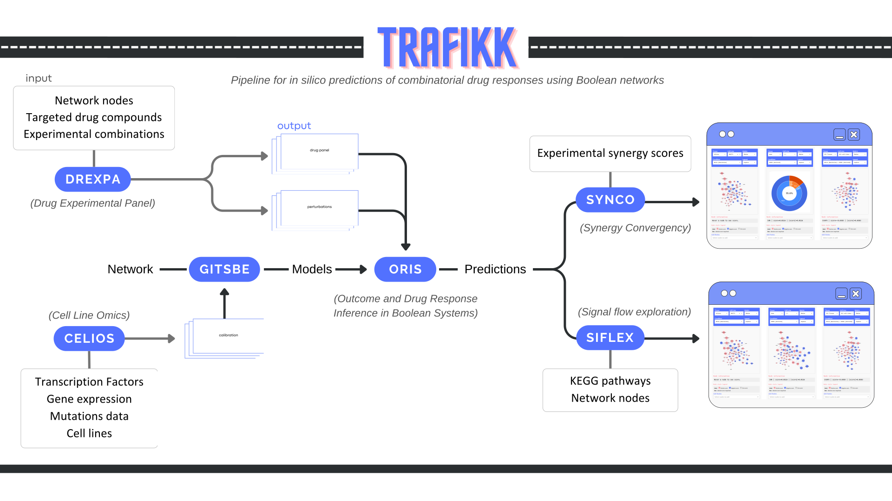

# TRAFIKK

**Systematic prediction and mechanistic interpretation of anticancer drug synergies**

Trafikk is a computational pipeline for *in silico* prediction and mechanistic interpretation of drug combination responses in cancer. It integrates cell-line-specific molecular contexts with Boolean network modelling and signal-propagation analysis to identify synergistic drug pairs and explain how synergy emerges at the pathway level.

---

## Overview

Trafikk simulates drug perturbations on cell-line-calibrated Boolean models of cancer signalling networks, generating functional response profiles for single drugs and combinations. These profiles enable both synergy classification and mechanistic interpretation of the underlying signalling dynamics.

### Pipeline modules

| Module           | Description                                                                                                                                        |
| ---------------- | -------------------------------------------------------------------------------------------------------------------------------------------------- |
| **Celios** | Integrates cell-line omics data (mutations, CNV, TF activity) to calibrate the base network to specific biological contexts.                       |
| **Gitsbe** | Generates ensembles of logic-based models for each calibrated cell-line network.                                                                   |
| **Drexpa** | Maps experimental drug panels to*in silico* perturbation profiles using public target databases (GDSC, OpenTargets, ChEMBL, UniProt, BindingDB). |
| **Oris**   | Computes*in silico* viability and synergy scores via signal-propagation analysis (built on [BooLEVARD](https://github.com/druglogics/boulevard)).   |
| **Synco**  | Benchmarks predictions against experimental synergy data using standard classification metrics (AUC-ROC, AUC-PR, F1, accuracy, recall, precision). |
| **Siflex** | Performs pathway-level functional analysis of drug effects and generates mechanistic hypotheses for synergistic responses.                         |

---

## Installation

Refer to each module's repository for specific installation instructions and dependencies:

- [**Celios**](https://github.com/druglogics/trafikk/tree/main/Modules/celios)
- [**Gitsbe**](https://github.com/druglogics/gitsbe)
- [**Drexpa**](https://github.com/druglogics/drexpa)
- [**Oris**](https://github.com/druglogics/trafikk/tree/main/Modules/oris)
- [**Synco**](https://github.com/druglogics/synco)
- [**Siflex**](https://github.com/druglogics/siflex)

---

## Usage

A step-by-step usage tutorial is available in the repository. The pipeline is modular — each module can be run independently or as part of the full workflow.

---

## Documentation

Full unified documentation is currently under development and will be available at [GitHub Pages](https://druglogics.github.io/trafikk/).

---

## Synergy quantification

Drug synergy is assessed using **Bliss independence**:

$$
\Delta_{\text{Bliss}} = V_{AB} - V_A \cdot V_B
$$

where $V_{AB}$ is the viability under combined perturbation and $V_A$, $V_B$ are the single-drug viabilities. Negative values indicate synergy.

---

## Built upon

- [DrugLogics](https://github.com/druglogics) — model generation and calibration
- [BooLEVARD](https://github.com/farinasm/boolevard) — signal-propagation analysis in Boolean models

---

## Citation

> Fariñas M.\*, Bermúdez V.\*, Tsirvouli E., Lippestad K., Zobolas J., Aittokallio T., Lehti K.†, Flobak Å.†
> **TRAFIKK: systematic prediction and mechanistic interpretation of anticancer drug synergies.**
> *Submitted.*

---

## License

This project is licensed under the [GNU General Public License v3.0](LICENSE).
